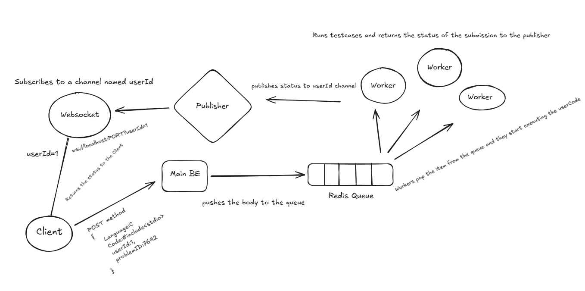

# LeetCode Backend

A scalable backend system for a LeetCode-style code execution platform, built with a microservices architecture using Node.js, TypeScript, Redis, and WebSockets.

## Architecture



The system consists of three services:

| Service | Description |
|---|---|
| **mainBE** | REST API server that accepts code submissions and pushes them to a Redis queue |
| **webSocket** | WebSocket server that pushes real-time execution results back to the client |
| **worker** | Background worker that pops submissions from the Redis queue, runs them, and publishes results |

### Flow

1. Client submits code via `POST /checkCode` to **mainBE**
2. **mainBE** pushes the submission to a Redis list (`store`)
3. **worker** pops the submission, executes it, and publishes the result to a Redis channel keyed by `userId`
4. **webSocket** server is subscribed to that channel and forwards the result to the connected client in real time

## Getting Started

### Prerequisites

- Node.js (v18+)
- Redis (running locally or via a remote URL)

### Installation

Install dependencies for each service:

```bash
cd mainBE && npm install
cd ../webSocket && npm install
cd ../worker && npm install
```

### Configuration

Each service reads environment variables from a `.env` file. Copy the example files and fill in your values:

```bash
cp mainBE/.env.example mainBE/.env
cp webSocket/.env.example webSocket/.env
cp worker/.env.example worker/.env
```

**.env variables:**

```
PORT=3000
REDIS_URL=redis://localhost:6379
```

### Running the Services

From the root directory:

```bash
# Start the main API server
npm run mainBE

# Start the WebSocket server
npm run webSocket

# Start the worker
npm run worker
```

Each script compiles TypeScript and runs the service.

## API

### `POST /checkCode`

Submit code for execution.

**Request body:**

```json
{
  "language": "javascript",
  "code": "console.log('hello')",
  "userId": "user123",
  "problemId": "problem456"
}
```

**Response:**

```json
{
  "msg": "Code has been pushed to the queue"
}
```

### WebSocket

Connect to the WebSocket server with your `userId` as a query parameter:

```
ws://localhost:<PORT>?userId=user123
```

Once the worker processes your submission, you will receive a message:

```json
{
  "type": "response",
  "data": { "result": "success" },
  "timestamp": 1234567890
}
```

## Tech Stack

- **Runtime:** Node.js
- **Language:** TypeScript
- **API Framework:** Express
- **Real-time:** WebSockets (`ws`)
- **Queue / Pub-Sub:** Redis
